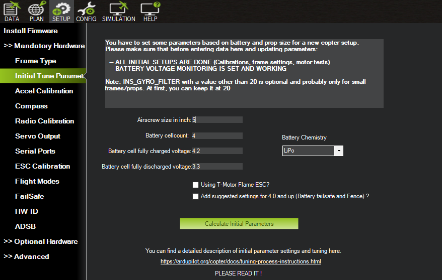
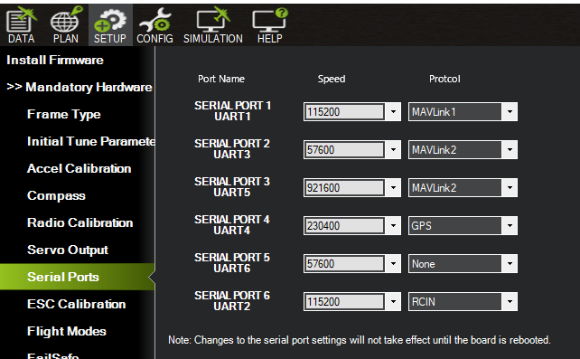
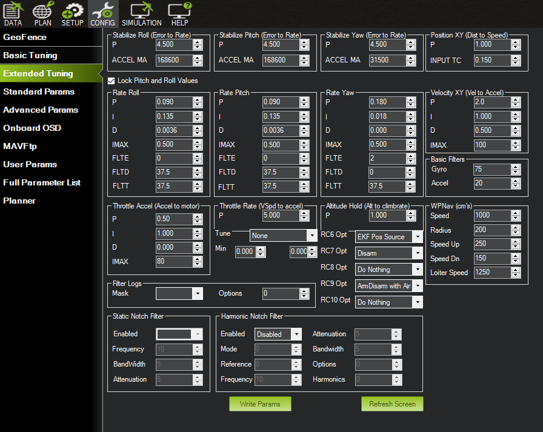
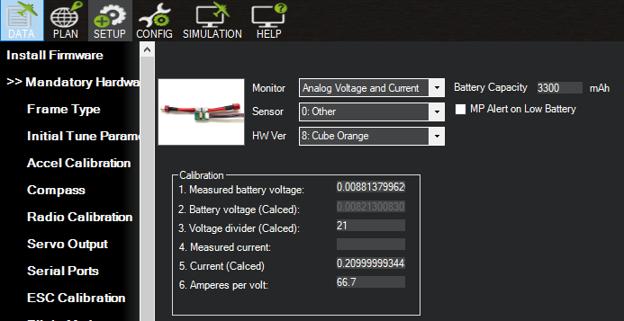
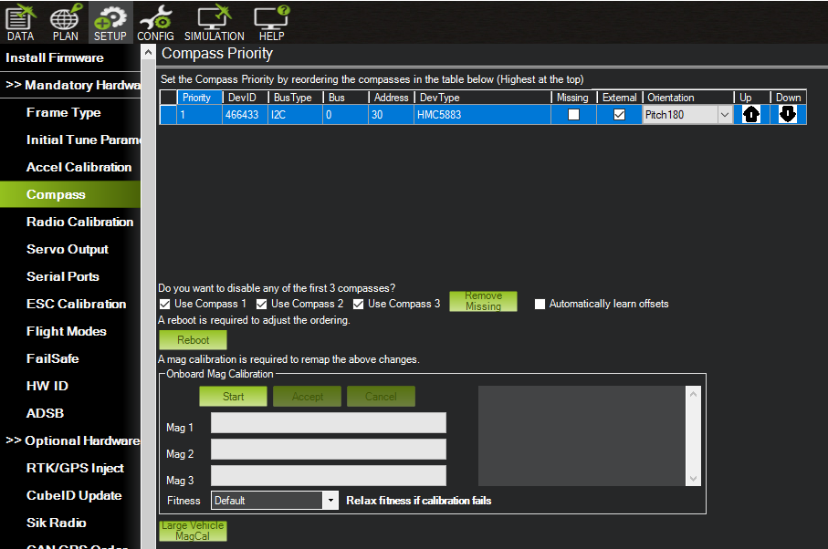
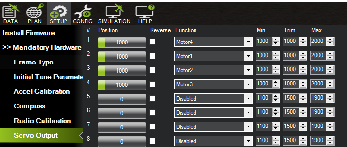
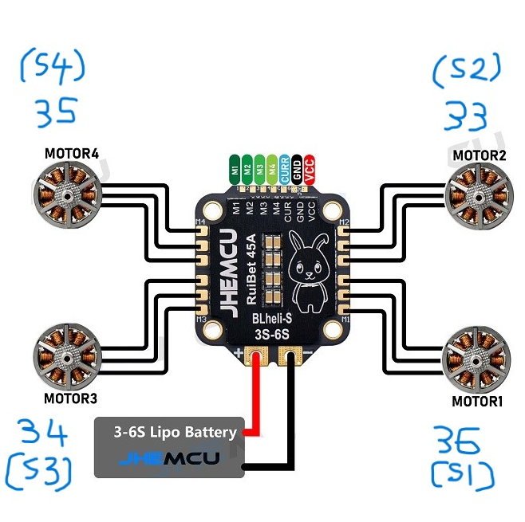

# Getting Started

This is userguide on how to i develop indoor programmable drone using Ardupilot. I'll divide this section into few
parts.

# Hardware Setup
## 1. Components

Below is list of components used in this developments

* 1 x Raspberry Pi Zero 2 
* 1 x 32Gb - 64Gb SD card
* 1 x Matek F405 HDTE Flight Controller
* 1 x Happy Model 2.4 Express EP2 Elrs Receiver
* 1 x 4 in 1 Ruibet JHEMCU 45A ESC
* 1 x MTF-01 Optical and Range Sensor
* 1 x HMC5883L 3-Axis Digital Compass Breakout Board
* 1 x QAV250 Totem Drone Frame
* 4 x HSKRC 2205-1700KV Motor
* 1 x CNHL Black Series 14.8V 1500mAh 100C 4S Lipo Battery 
* 1 x XT60 Plug
* 4 x 5045 CW CCW GEMFAN 2205 2207 2810 2306 Propeller


## 2. Connection

Below is hardware `UART` connection using `UART` between `RPI Zero 2` and `MatekF405-HDTE`.

| Rpi Zero Pin| Matek F405-HDTE pin  | 
| --------    | -------------------  |
|     3.3V    |         4V5          |            
|     Gnd     |         Gnd          |            
|     TX (14) |         RX5          |            
|     RX (15) |         TX5          |           


Below is hardware `ELRS` connection to `MatekF405-HDTE`

| ELRS Pin    | Matek F405-HDTE pin  | 
| --------    | -------------------  |
|     3.3V    |         4V5          |            
|     Gnd     |         Gnd          |            
|     TX      |         RX2          |            
|     RX      |         TX2          |    

Below is hardware `MTF-01` connection to `MatekF405-HDTE`

| MTF-01 Pin  | Matek F405-HDTE pin  | 
| --------    | -------------------  |
|     3.3V    |         4V5          |            
|     Gnd     |         Gnd          |            
|     TX      |         RX1          |            
|     RX      |         TX1          |    

Below is hardware `Compass` connection to `MatekF405-HDTE`

| Compass Pin | Matek F405-HDTE pin  | 
| --------    | -------------------  |
|     3.3V    |         4V5          |            
|     Gnd     |         Gnd          |            
|     SDA     |         SDA          |            
|     SCL     |         SCL          |    

# Software Setup

## 1. Software and Tool

Below is Software i used 
```
* Mission Planner 1.3.81 
* 64 bit Rpi OS Image
```

## 2. Custom Ardupilot Firmware

You need to build and generate customer firmware for MATEK-F405HDTE Ardupilot.
Please visit this link  Ardupilot Custom Firmware Builder:
```
https://custom.ardupilot.org/add_build
```

From build select
* Select Vehicle - Copter
* Select Branch - Latest
* Select Board - MateF405-TE

```
Copter - Mode Guided NoGPS
MSP - MSP Optical Flow and MSP Sensors
Sensors - Optical Flow MAVLINK Sensor
```

Then hit `Generate build`. Then you have to download
```
arducopter.apj
arducopter.bin
arducopter_with_bl.hex
```

Then use `INAV` to flash the MATEKF405 flight controller. You've to ensure FC in `dfu` mode and flash.

# Ardupilot Specific Setup

Below is setting i use in Ardupilot for this 5 inch Indoor Quadcopter build. 

## UART Order
These are Default `UART` order

| Ardupilot Serial | Matek F405-HDTE UART   | 
| --------         | -------------------    |
|     Serial0      |         USB            |            
|     Serial1      |         UART1          |            
|     Serial2      |         UART3          |            
|     Serial3      |         UART5          | 
|     Serial4      |         UART4          |            
|     Serial5      |         UART6          |            
|     Serial6      |         UART2 (Tx only unless BRD_ALT_CONFIG=1)|     


From Ardupilot `setup` go to:

## 1. Propeller Size

Go to `Initial Tune Parameter` and select
```
Airscrew size in in inch - 5 (This to indicate we're using 5 inch propeller)
Battery Cellcount - 4 (This to indicate a 4s battery)
```

Calculate initial parameters and write.


## 2. ELRS 

I'm using `Serial Port 6` in Ardupilot but `UART2` in MatekF405-HDTE Controller 
* To enable Happy Model ELRS EP1, i enable following parameter in ardupilot.
* Go to `Config` and then to `Full Parameters List`.

```
SERIAL6_PROTOCOL = 23
SERIAL6_BAUD = 115
SERIAL6_OPTIONS = 0
RC_PROTOCOL = 1
RSSI_TYPE = 3

BRD_ALT_CONFIG = 1 Then reboot your drone for change to take place.

FLTMODE_CH = 8
RC_OPTIONS = 3872 (default is 32)  

Password for Binding Phrase is : Eldernangkai92
```
Here we need to enable 
* Use passthrough for CRSF telemetry
* Suppress CRSF mode/rate message for ELRS systems
* Enable multiple receiver support

Also i set `CHANNEL9` as my arm. This can be configure in `extended config`.

## 3. Optical Flow

I'm using `Serial Port 1` in Ardupilot but `UART1` in MatekF405-HDTE Controller 

```
SERIAL1_PROTOCOL = 1 (Mavlink1)
SERIAL1_BAUD = 115
SERIAL1_OPTIONS = 0
FLOW_TYPE=5
```

## 4. RangeFinder
```
RNGFND1_TYPE = 10
RNGFND1_ORIENT = 25
RNGFND1_MIN_CM = 2
RNGFND1_MAX_CM = 800
RNGFND1_GNDCLEAR = 5
```

## 5. EKF3 Setup

Bear in mind, this setup is totally for `indoor` setup !, therefore we disable any `GPS` related.
```
EK3_SRC_OPTIONS = 3
EK3_SRC1_POSXY = 0
EK3_SRC1_POSZ = 2
EK3_SRC1_VELXY = 5 
EK3_SRC1_VELZ = 0
EK3_SRC1_YAW = 1

EK3_SRC2_POSXY = 0
EK3_SRC2_POSZ = 2
EK3_SRC2_VELXY = 5 
EK3_SRC2_VELZ = 0
EK3_SRC2_YAW = 1

EK3_SRC3_POSXY = 0
EK3_SRC3_POSZ = 2
EK3_SRC3_VELXY = 5 
EK3_SRC3_VELZ = 0
EK3_SRC3_YAW = 1
```

If you want to transition between different `SRC1`, `SRC2` and `SRC3`, then you set the following.
In  my casem i'm using `knob controller` of `box master`.
```
RC6_OPTION = 90
```

After you rotate your knob, you'll observe the EKF source change in `Ardupilot`.

Reboot the `Flight Controller`.

## 6. Raspberry Pi and Flight Controller UART 

I'm using `Serial Port 3` in Ardupilot but `UART5` in MatekF405-HDTE Controller 

```
SERIAL3_BAUD = 921
SERIAL3_OPTIONS = 0
SERIAL3_PROTOCOL = 2 (Mavlink2)
```

In general overall `Serial Ports` view should look as follow


## 7. Flight Mode

I'm using Flight Mode as follow. Please ensure to use `FLTMODE_CH = 8` in this case.

Under `Extended Tuning` please set `RC6`, `RC7` and `RC9` to the following.



## 8. Transmitter Setup

I'm using `Master Boxer` ELRS Controller, you will have to calibrate your Transmitter
and map the `mode` appropriately in your transmitter. My setup i'm using these mode
```
ARM
DISARM
STABILIZE
ALTITUDE_HOLD
POSITION_HOLD
LOITER
LAND
```

In this setup, we're using `Optical FLow` and `RangeFinder` data as a primary sources.

## 9. Battery Setup

We've to enable Battery monitor as following. 
* In my case i'm using 4S Battery. 
* You have to enter measured battery voltage into `Measured battery voltage` field



## 10. Compass

Compass `DevID` should be detected by Ardupilot. For first setup, you have to calibrate the `Compass`.



## 11. ESC DSHOT Setup

Setup for ESC Dshot 600 for Ardupilot

```
MOT_PWM_TYPE = 6
SERVO_DSHOT_ESC = 2
SERVO_BLH_AUTO = 1 (To enable BLHeli pas through for ESC Firmware Updates)
SERVO_BLH_OTYPE = 6
```

If you observe abnormality, may consider to flash the firmaware of ESC and calibrate the ESC using `BLHELI Configurator`.

## 12. Servo or Motor Setup

You have to setup the Motor servo output and placement correctly. 
* See below snapshot



Under `Full Parameter List`, servo setup as follow:

```
SERVO1_FUNCTION = 36
SERVO2_FUNCTION = 33
SERVO3_FUNCTION = 34
SERVO4_FUNCTION = 35
```
See below diagram. This is `ESC` i used in this setup.




# Raspberry Pi Specific Setup
## 1. Flash Image

Please ensure that you have flash RPI with mentioned Image using RPI imager.

## 2. Python Libraries 

Python Version
```
Python 3.9.2 Mar 12, 2021
```

Below is list of python libraries that you have to install in RPi Zero 2
```
sudo apt-get update
sudo apt-get upgrade
sudo apt-get install python-pip
sudo apt-get install python-dev
sudo apt-get install screen python-wxgtk4.0 python-lxml
sudo apt-get install git
sudo pip install pexpect
sudo pip install future == 0.18.3
sudo pip install pyserial == 3.5b0
sudo pip install dronekit == 2.9.2
sudo pip install MAVProxy == 1.8.60
sudo pip install keyboard == 0.13.5
sudo pip install numpy = 1.24.3
sudo pip install opencv-python = 4.5.3.56
sudo pip install pexpect = 4.8.0
sudo pip install picamera = 1.13
sudo pip install picamera2 = 0.3.12
sudo pip install pycoral = 2.0.0
sudo pip install pygame = 1.9.6
sudo pip install pymavlink = 2.4.37
sudo pip install v4l2-python3 = 0.3.2
sudo pip install gpiozero = 1.6.2
sudo pip install tflite-runtime == 2.5.0.post1
sudo pip install tflite-support == 0.4.3
sudo pip install RPi.GPIO == 0.7.0

```

## 3. Enable Serial in RPI

To enable a successful `UART` connection, we have to enable below configuration.
* Please follow below step.

```
* sudo raspi-config
```

and then go to
```
interface_options --> Serial Port
```
You will then serve with `Would you like a login shell to be accessible over serial ?`
```
Choose <No>
```

You will then serve with `Would you like the serial port hardware to be enabled ?`
```
Choose <Yes>
```

Then `reboot` the RPI

Next, we have to disable the bluetooth as follow, you have open this file.
```
sudo vi /boot/config.txt 
```

And inside this file, `go to last line` and do the following
```
* dtoverlay=disable-bt (disable the bluetooth by adding this line)
* enable_uart = 1 (enable this line or add this line if it's missing)

* save the file and reboot RPI
```

you should see `ttyAMA0` if you run following command
```
ls /dev/ttyAMA0
```


## 4. Create Access Point

To creaete access point from our `Raspberry Pi Zero 2`. Do the following. But, in my setup i didnt set
the static `IP address`.

Enable static `IP address` by adding following line
```
sudo vi /etc/dhcpcd.conf
```

and following line
```
 interface wlan0
 static ip_address=10.42.0.1/24
```

Next, we're going to configure `wpa_supplicant` to work in the access point mode.

```
sudo vi /etc/wpa_supplicant/wpa_supplicant.confg
```

and fill the following info
```
 network={
     ssid="pi-techmon"
     psk="2328"
     mode=2
     proto=RSN
     key_mgmt=WPA-PSK
     pairwise=CCMP
     group=CCMP
     auth_alg=OPEN
 }
```

Then enable the `dnsmasq` service
```
sudo systemctl enable dnsmasq
sudo systemctl start dnsmasq
```

Restart the `dhcpcd` service.
```
sudo systemctl restart dhcpcd
```


## 5. Enable Terminal Mode

To enable `Terminal` mode in our Rpi, please do the following.

```
sudo raspi-config
```

and go to `Boot Options` and choose
```
Console Autologin Text console, automatically logged in as `pi` user.
```

click save and `reboot` the RPI.

## 6. Test Connection

To test if connection is working. Run below command using mavproxy. You should see hearbeart data from flight controller
```
mavproxy.py --master=/dev/ttyACM0,921600
```


