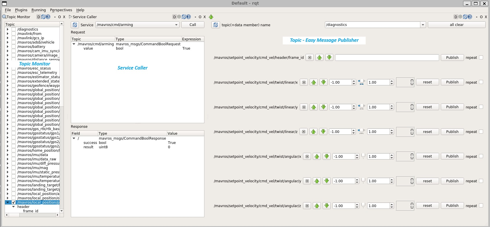

# Getting Started

In this userguide, i'm going to show how to control our `Mavros` drone using rqt
a. `Service`
b. `Topic`

## Step 1 - Run Gazebo

Open terminator terminal and run following command
```
gazebo --verbose ~/ardupilot_gazebo/worlds/iris_arducopter_runway.world 
```

Your gazebo should appear soon.

## Step 2 - Run SITL

In other terminal, please run SITL using following command based on below step
```
cd ~/ardupilot/ArduCopter

sim_vehicle.py -v ArduCopter -f gazebo-iris --console
```

This will launch SITL console into the windows

## Step 3 - Run APM Launcher

Since i'm running using MAVROS, it's important to run this launcher file first. Here,i'm going 
to show how you can create your own launch or launch directly from ROS

To run using default ros use following command. 
Here, tcp port is the same we use in our `dronekit` connection string
```
roslaunch mavros apm.launch fcu_url:=tcp://127.0.0.1:5763
```

## Step 4 - Run RQT

Advantage of RQT, is that it enable you to make a service call and execute topic to control the drone.
You can find list of topics and service published by `MAVROS` at this [link](https://clover.coex.tech/en/mavros.html)

### Main Published Topics
```
/mavros/state — status of connection to the flight controller and flight controller mode.

/mavros/local_position/pose — local position and orientation of the copter in the ENU coordinate system.

/mavros/local_position/velocity — current speed in local coordinates and angular velocities.

/mavros/global_position/global — current global position (latitude, longitude, altitude).

/mavros/global_position/local — the global position in the UTM coordinate system.

/mavros/global_position/rel_alt — relative altitude (relative to the arming altitude).

Messages published in the topics may be viewed with the rostopic utility, e.g., rostopic echo /mavros/state. See more in working with ROS.
```

### Main Services
```
/mavros/set_mode — set flight mode of the controller. Most often used to set the OFFBOARD mode to accept commands from Raspberry Pi.

/mavros/cmd/arming — arm or disarm drone motors (change arming status).
```

### Main Topics For Publication
```
/mavros/setpoint_position/local — set target position and yaw of the drone (in the ENU coordinate system).

/mavros/setpoint_position/global – set target position in global coordinates (latitude, longitude, altitude) and yaw of the drone.

/mavros/setpoint_position/cmd_vel — set target linear velocity of the drone.

/mavros/setpoint_attitude/attitude and /mavros/setpoint_attitude/att_throttle — set target attitude and throttle level.

/mavros/setpoint_attitude/cmd_vel and /mavros/setpoint_attitude/att_throttle — set target angular velocity and throttle level.
```

### Topics for Sending Raw Packets
```
/mavros/setpoint_raw/local — sends SET_POSITION_TARGET_LOCAL_NED message. Allows setting target position/target speed and target yaw/angular yaw velocity. The values to be set are selected using the type_mask field.

/mavros/setpoint_raw/attitude — sends SET_ATTITUDE_TARGET message. Allows setting the target attitude /angular velocity and throttle level. The values to be set are selected using the type_mask field

/mavros/setpoint_raw/global — sends SET_POSITION_TARGET_GLOBAL_INT. Allows setting the target attitude in global coordinates (latitude, longitude, altitude) and flight speed.
```

## Read Drone State From RQT

From RQT open the following
```
Plugins --> Topics --> Topic Monitor
```

From `Topic` list select below topic
```
/mavros/state
```
You should able to see drone status.

## Set drone mode From RQT

From RQT open the following
```
Plugins --> Services --> Service Caller
```

From `Service` select
```
/mavros/set_mode
```

and set the following

| Topic               | Type                          | Expression |
| --------            | -------                       | ---------- |
| /mavros/set_mode    | mavros_msgs/SetModeRequest    |            |
| base_mode           | uint8                         |     0.0    |
| custom_mode         | string                        |     GUIDED (To Change into GUIDED Mode)    | 


From SITL console, you should see the mode is now change to `GUIDED`

## Arm the drone From RQT

From the same RQT as above, select below `Service`
```
/mavros/cmd/arming
```

and set the following

| Topic               | Type                          | Expression |
| --------            | -------                       | ---------- |
| /mavros/cmd/arming  | mavros_msgs/CommandBoolReques |            |
| value               | bool                          |   True (Set to True to enable arming)|

Your drone should arm now as shown in the `Gazebo` simulator

## Land the drone From RQT

From the same RQT as above, select below `Service`
```
/mavros/cmd/land
```

and set the following

| Topic               | Type                          | Expression |
| --------            | -------                       | ---------- |
| /mavros/cmd/land    | mavros_msgs/CommandTOLRequest |            |
| min_pitch           | float32                       |     0.0    |
| yaw                 | float32                       |     0.0    | 
| latitude            | float32                       |     0.0    |
| longtitude          | float32                       |     0.0    |
| altitude            | float32                       |     0.0 (To enable land)|

Your drone should land now as shown in the `Gazebo` simulator

## Takeoff the drone from RQT

From the same RQT as above, select below `Service`
```
/mavros/cmd/takeoff
```

and set the following

| Topic               | Type                          | Expression |
| --------            | -------                       | ---------- |
| /mavros/cmd/takeoff | mavros_msgs/CommandTOLRequest |            |
| min_pitch           | float32                       |     0.0    |
| yaw                 | float32                       |     0.0    | 
| latitude            | float32                       |     0.0    |
| longtitude          | float32                       |     0.0    |
| altitude            | float32                       |     1.0 (To enable takeoff for 1 Metre)|

To takeoff, you may have to `arm` first and then `takeoff` with the allocated time. Otherwise will fail.

You will see, your drone is now hover at 1 metre

## To control the movement of drone from RQT

From RQT open the following
```
Plugins --> Topics --> Easy Message Publisher
```

From `Topic (+data member) name` select below to set target linear velocity of the drone
```
/mavros/setpoint_velocity/cmd_vel
```

You can use your mouse scroll wheel to control the drone `movement` to control the `speed` of drone

See below snapshot of overall RQT operation

