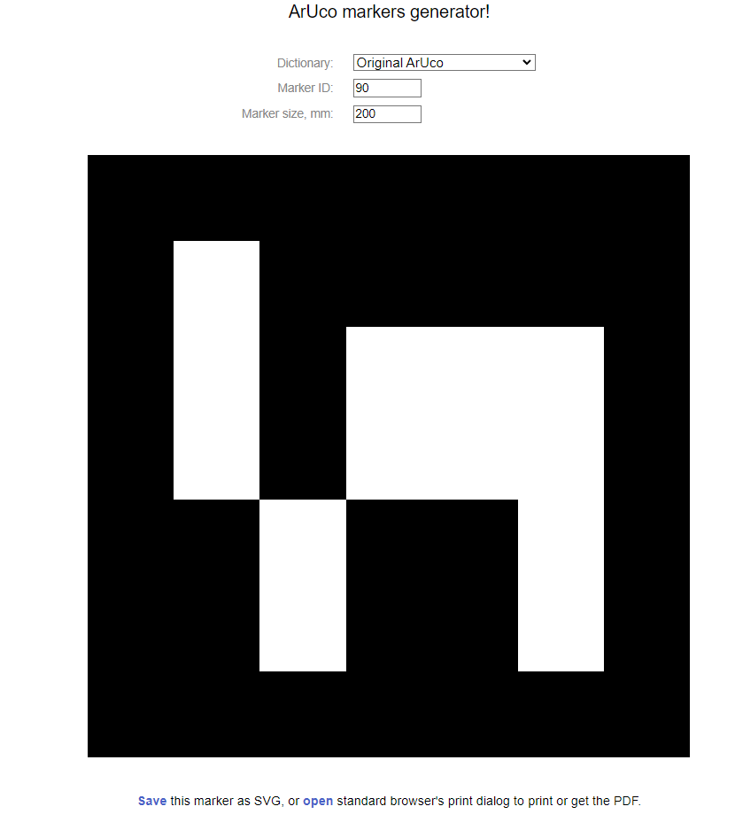
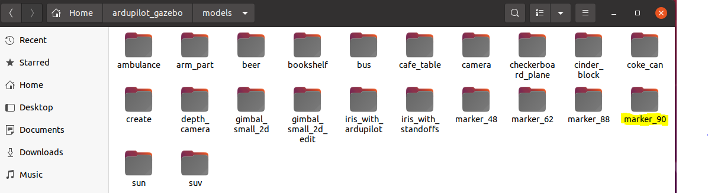
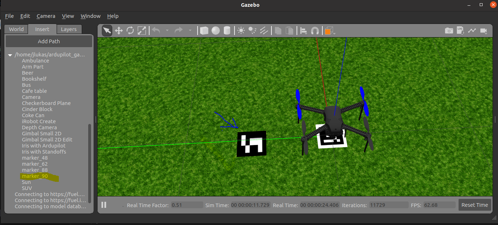

# Getting Started

In this userguide, i'm going to show you on how to setup `Aruco Marker` in Gazebo.
Please folow step as follow:

# Aruco Gazebo Installation Step
## Step 1: Copy aruco_marker contents to Gazebo

In this step, copy `aruco_marker` content into our `ardupilot_gazebo` as follow
```
cd aruco_marker

cp -r * ~/ardupilot_gazebo/models/

```

Under `models`, you should see the following contents already
```
marker_48
marker_62
marker_88
```

## Step 2: Run Gazebo to test the feature

use below command to launch `gazebo`
```
roslaunch gazebo_ros iris_world.launch 
```

Then from `Gazebo Environment`, you can select `marker_48` or other marker and place it to `Gazebo Ground`.

# To Create new aruco ID 90 for Gazebo

## Step 1: Create aruco markers from website

Visit [Aruco Generator](https://chev.me/arucogen/) and set the following

```
Dictionary : Original AruCo
Marker ID : 90
Marker Size, mm : 200 (This is size of aruco 20 cm x 20cm, measured from black edge to end edge of aruco)
```

Example as follow



## Step 2: Save the Marker

From the site, then `save` the marker as `SVG`.
You should see new marker named as 

```
aruco-90.svg
```

## Step 3: Convert SVG to PNG

Next we need to convert this `SVG` format to `PNG`. Please visit this link [SVG TOPNG](https://svgtopng.com/).
From the page upload `aruco-90.svg` and when for the conversion to complete.

Once `done`, download the `aruco-90.png` 

## Step 4: Create aruco 90 for Gazebo Simulation

Here we're going to install new `aruco 90` for our Gazebo simulation.

do the following
```
cd ~/ardupilot_gazebo/models/

cp -r marker_88 marker_90
```

New `directory` should look as follow:




Next we're going to copy generated `aruco-90.png` into this new created directory as follow
```
cp -r aruco-90.png ~/ardupilot_gazebo/models/marker_90/materials/textures/
```

Next we're going to modify the file `content` as follow inside this `marker_90` directory


## Step 4: Modify the file contents 

## model.config
```
<?xml version="1.0"?>

<model>
  <name>marker_90</name>
  <version>1.0</version>
  <sdf version="1.5">model.sdf</sdf>

  <author>
    <name>User</name>
  </author>

  <description>
    Fiducial marker for AR
  </description>
</model>
```

## model.sdf
```
<?xml version="1.0" ?>
<sdf version="1.5">
  <model name="marker_90">
    <static>true</static>
    <link name="link">
      <pose>0.0 0.0 5e-05 0.0 0.0 0.0</pose>
      <collision name="collision">
        <geometry>
          <!-- Box or plane geometry is used -->
        <box><size>0.2 0.2 0.0001</size></box></geometry>
      </collision>
      <visual name="visual">
        <geometry>
          <!-- Box or plane geometry is used -->
        <box><size>0.2 0.2 0.0001</size></box></geometry>
        <material>
          <script>
            <name>marker_90</name>
            <uri>model://marker_90/materials/scripts/</uri>
            <uri>model://marker_90/materials/textures/</uri>
          </script>
        </material>
      </visual>
    </link>
  </model>
</sdf>
```

## marker.material
```
material marker_90
{
  technique
  {
    pass
    {
      texture_unit
      {
        texture aruco-90.png
      }
    }
  }
}
```

## Step 5: Run Gazebo to add our Aruco Marker 90

use below command to launch `gazebo`
```
roslaunch gazebo_ros iris_world.launch 
```

Then from `Gazebo Environment`, you can select `marker_90` it to `Gazebo Ground`.

Result as follow:

